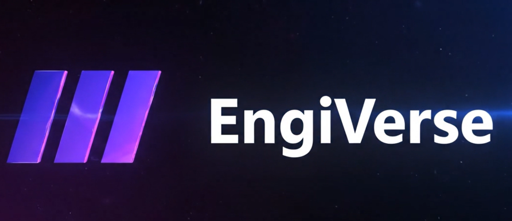
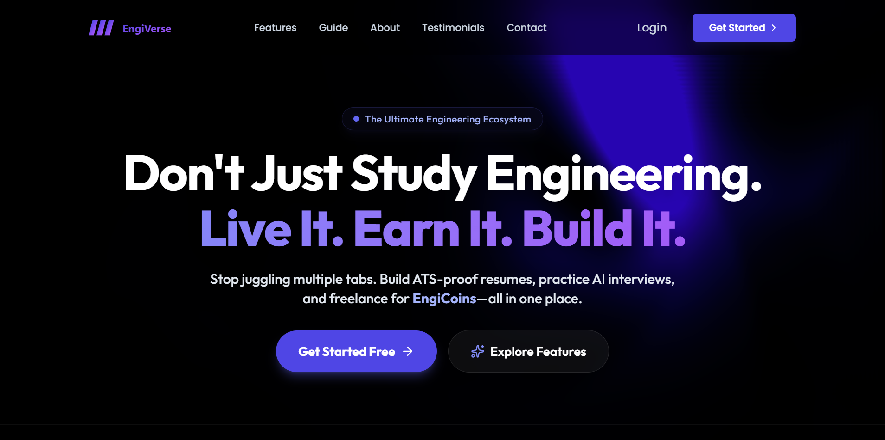
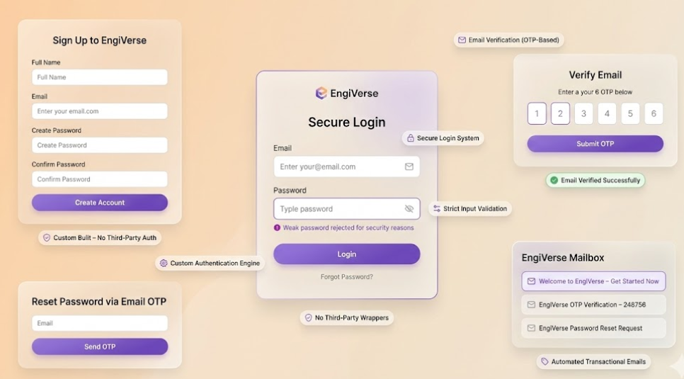
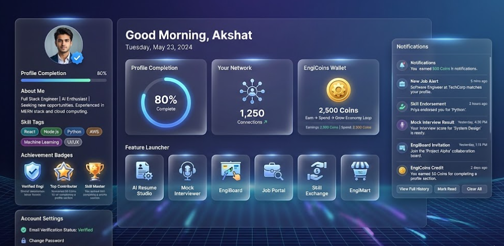
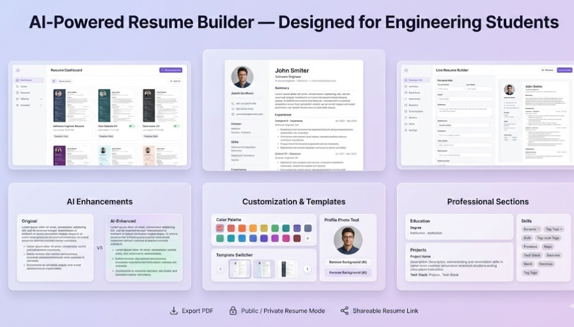
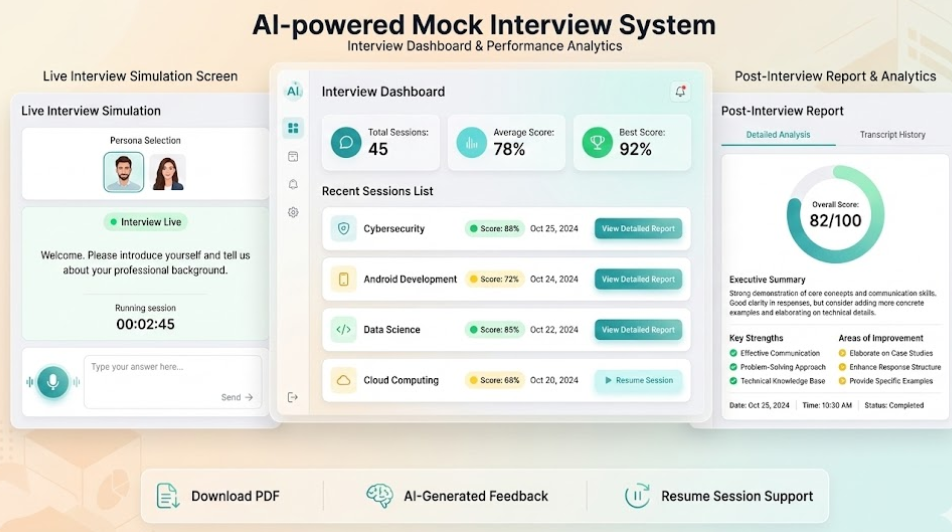
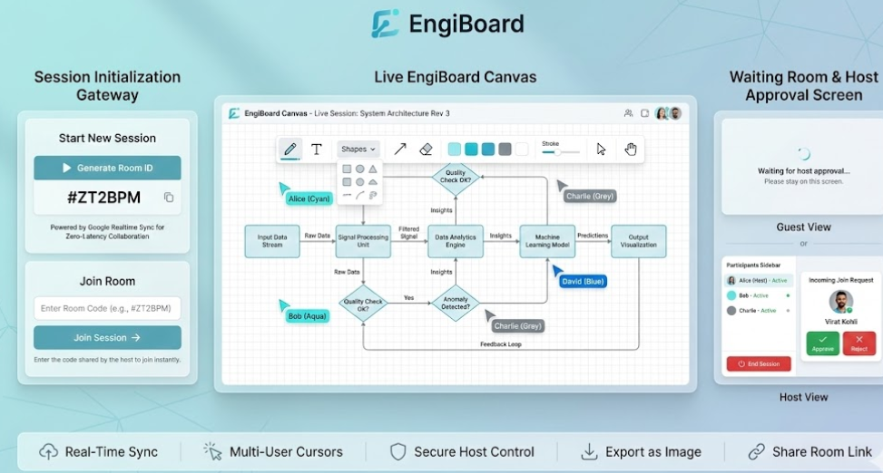
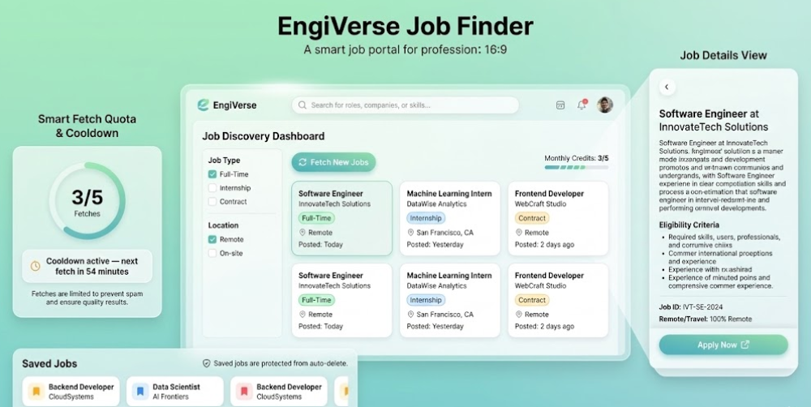
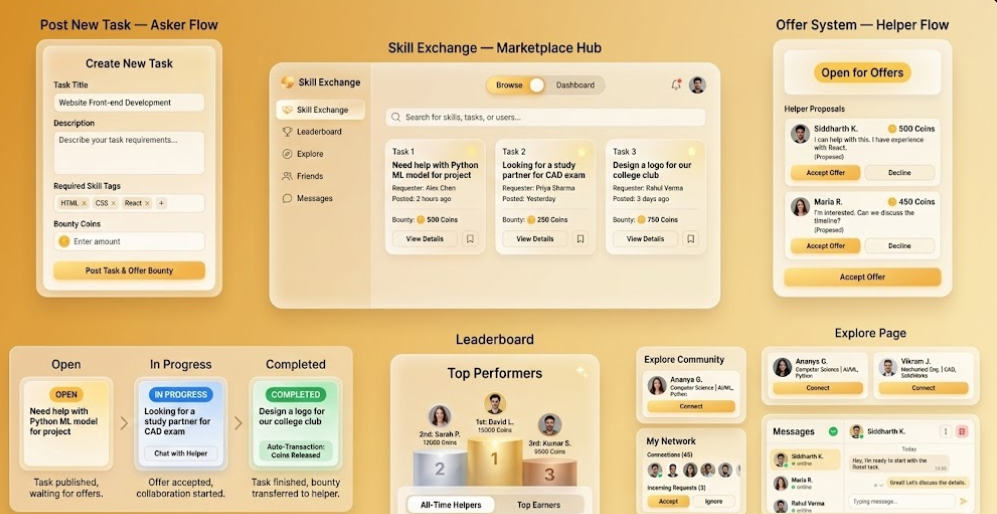
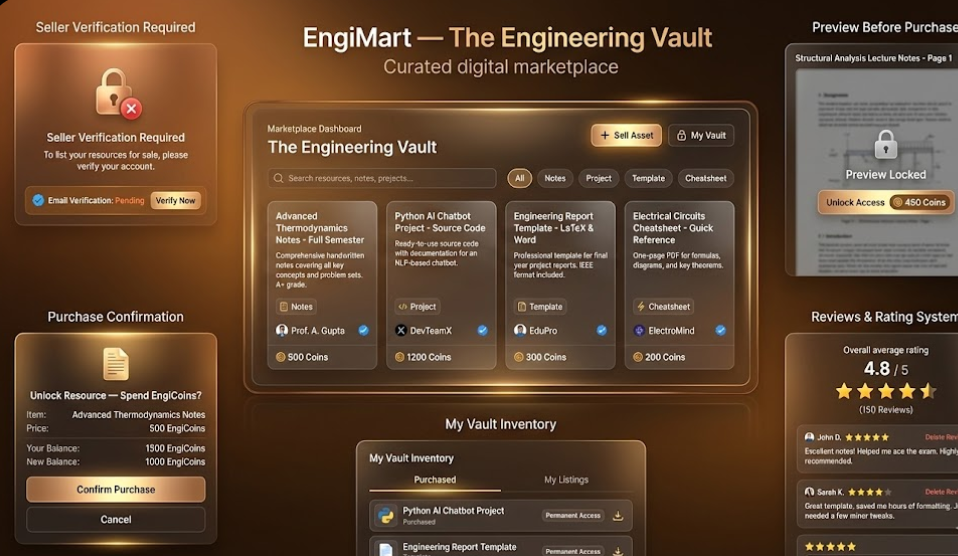

<div align="center">
<a href="https://github.com/AkshatSharma555/EngiVerse-App">

</a>

<p align="center" style="font-size: 1.1rem; margin-top: 10px;">
<b>Bridging the Gap: Education, Economy, and Employment.</b><br>
The first ecosystem where engineers don't just learn—they build, earn, and get hired.
</p>

<p align="center">
<a href="https://engiverse-chi.vercel.app/">

</a>
&nbsp;&nbsp;
<a href="https://youtu.be/-Q39cIpNnV8">

</a>
&nbsp;&nbsp;
<a href="#-installation--setup">

</a>
</p>
</div>

<br />

<div align="center">
<h2 style="font-size: 28px; margin-bottom: 5px;">Why We Need EngiVerse</h2>
<p style="font-size: 16px; font-style: italic; margin-bottom: 30px;">
Addressing the critical systemic inefficiencies in the modern engineering ecosystem.
</p>
</div>

<table border="0" width="100%">
<tr>
<td width="50%" valign="top">
<h3 style="margin-bottom: 5px;">1. Siloed Learning Environment</h3>
<p>Engineering students currently operate in isolation. Collaboration is restricted to localized peer groups, limiting exposure to diverse problem-solving approaches and mentorship.</p>

<h3 style="margin-bottom: 5px;">2. The ATS Compatibility Gap</h3>
<p>Talented candidates often fail automated screenings because traditional resumes lack keyword optimization and proper formatting required by Applicant Tracking Systems (ATS).</p>

<h3 style="margin-bottom: 5px;">3. Economic Barriers to Quality</h3>
<p>High-quality resources, mentorship, and roadmaps are frequently locked behind paywalls, creating an inequitable divide between learning potential and financial capacity.</p>
</td>

<td width="50%" valign="top">
<h3 style="margin-bottom: 5px;">4. The Experience-Employment Paradox</h3>
<p>Students face the circular problem of needing experience to get a job, but needing a job to gain experience. There is a lack of platforms for verifiable micro-freelancing.</p>

<h3 style="margin-bottom: 5px;">5. Lack of Real-World Simulation</h3>
<p>Technical interviews require specific behavioral and problem-solving practice. Without accessible mock environments, candidates face high anxiety during actual placements.</p>

<h3 style="margin-bottom: 5px;">6. Ecosystem Fragmentation</h3>
<p>The workflow is disjointed across multiple platforms—learning on YouTube, coding on GitHub, networking on LinkedIn. This fragmentation reduces focus and productivity.</p>
</td>
</tr>
</table>

<br />

<div align="center">
<h2 style="font-size: 30px; margin-bottom: 20px;">⚡ What is EngiVerse?</h2>
</div>

<table border="0" width="100%" cellspacing="0" cellpadding="0">
<tr>
<td width="65%" valign="middle" style="padding-right: 20px;">

</td>

<td width="35%" valign="middle" style="padding-left: 10px;">
<h3 style="margin-bottom: 15px; font-size: 22px; color: #f0f6fc;">The Ultimate Engineering Ecosystem</h3>
<p style="font-size: 16px; line-height: 1.6; color: #c9d1d9; margin-bottom: 15px;">
EngiVerse is more than just a platform; it's a <b>gamified digital campus</b> bridging the critical gap between academic theory and industry reality.
</p>
<p style="font-size: 16px; line-height: 1.6; color: #c9d1d9; margin-bottom: 25px;">
We integrate <b>AI-driven career tools</b> with a <b>real-time collaborative economy</b>, creating a self-sustaining environment where you can build your worth—literally and figuratively.
</p>

<a href="https://engiverse-chi.vercel.app/">

</a>
</td>
</tr>
</table>

<br />
<hr />
<br />
<div align="center">
<h2 style="font-size: 34px; color: #1F2933; margin-bottom: 10px;">🚀 Features Overview </h2>
<p style="color: #666; font-size: 18px; max-width: 800px;">
A deep dive into the 8 core modules that power the EngiVerse Ecosystem.
</p>
</div>
<br />

<table border="0" width="100%" cellspacing="0" cellpadding="0">
<tr>
<td width="55%" valign="middle" style="padding-right: 20px;">

</td>
<td width="45%" valign="middle" style="padding-left: 10px;">
<h3 style="font-size: 24px; color: #1F2933; margin-bottom: 8px;">🔐 Custom Security Engine</h3>
<p style="margin-bottom: 15px;">
<code style="background: #fff7ed; color: #c2410c; padding: 4px 8px; border-radius: 4px; font-weight: bold;">JWT</code>
<code style="background: #fff7ed; color: #c2410c; padding: 4px 8px; border-radius: 4px; font-weight: bold;">Bcrypt</code>
<code style="background: #fff7ed; color: #c2410c; padding: 4px 8px; border-radius: 4px; font-weight: bold;">Nodemailer</code>
</p>
<p style="font-size: 16px; color: #555; line-height: 1.6;">
<b>No Third-Party Wrappers. Pure Sovereignty.</b><br>
A robust security fortress built from scratch. We don't rely on Clerk or Auth0. Features include a secure OTP-based email verification system, strict input validation loops, and encrypted session management.
</p>
</td>
</tr>
</table>

<br /><br />

<table border="0" width="100%" cellspacing="0" cellpadding="0">
<tr>
<td width="45%" valign="middle" style="padding-right: 20px;">
<h3 style="font-size: 24px; color: #1F2933; margin-bottom: 8px;">📊 Student Command Center</h3>
<p style="margin-bottom: 15px;">
<code style="background: #eff6ff; color: #1d4ed8; padding: 4px 8px; border-radius: 4px; font-weight: bold;">Dynamic UI</code>
<code style="background: #eff6ff; color: #1d4ed8; padding: 4px 8px; border-radius: 4px; font-weight: bold;">Gamification</code>
</p>
<p style="font-size: 16px; color: #555; line-height: 1.6;">
<b>Your Growth at a Glance.</b><br>
The dashboard acts as the central nervous system. It tracks your "Profile Health," visualizes your professional network size, and manages your <b>EngiCoins Wallet</b> in real-time. Includes time-aware dynamic greetings.
</p>
</td>
<td width="55%" valign="middle" style="padding-left: 10px;">

</td>
</tr>
</table>

<br /><br />

<table border="0" width="100%" cellspacing="0" cellpadding="0">
<tr>
<td width="55%" valign="middle" style="padding-right: 20px;">

</td>
<td width="45%" valign="middle" style="padding-left: 10px;">
<h3 style="font-size: 24px; color: #1F2933; margin-bottom: 8px;">📄 AI Resume Studio</h3>
<p style="margin-bottom: 15px;">
<code style="background: #f3e8ff; color: #7e22ce; padding: 4px 8px; border-radius: 4px; font-weight: bold;">Google Gemini API</code>
<code style="background: #f3e8ff; color: #7e22ce; padding: 4px 8px; border-radius: 4px; font-weight: bold;">React PDF</code>
</p>
<p style="font-size: 16px; color: #555; line-height: 1.6;">
<b>Engineer Your Resume for Robots.</b><br>
Standard resumes get rejected. Ours get read. Features a split-screen builder with "Magic Enhance" (AI rewriting) and automated background removal for professional headshots. 100% ATS-friendly export.
</p>
</td>
</tr>
</table>

<br /><br />

<table border="0" width="100%" cellspacing="0" cellpadding="0">
<tr>
<td width="45%" valign="middle" style="padding-right: 20px;">
<h3 style="font-size: 24px; color: #1F2933; margin-bottom: 8px;">🎙️ AI Mock Interviewer</h3>
<p style="margin-bottom: 15px;">
<code style="background: #ecfdf5; color: #047857; padding: 4px 8px; border-radius: 4px; font-weight: bold;">Speech-to-Text</code>
<code style="background: #ecfdf5; color: #047857; padding: 4px 8px; border-radius: 4px; font-weight: bold;">Adaptive Persona</code>
</p>
<p style="font-size: 16px; color: #555; line-height: 1.6;">
<b>Practice Before the Battle.</b><br>
A voice-enabled simulation where the AI acts as a strict technical recruiter. It adapts questions based on your answers (e.g., digging deeper into React hooks) and generates a detailed performance report card.
</p>
</td>
<td width="55%" valign="middle" style="padding-left: 10px;">

</td>
</tr>
</table>

<br /><br />

<table border="0" width="100%" cellspacing="0" cellpadding="0">
<tr>
<td width="55%" valign="middle" style="padding-right: 20px;">

</td>
<td width="45%" valign="middle" style="padding-left: 10px;">
<h3 style="font-size: 24px; color: #1F2933; margin-bottom: 8px;">✏️ EngiBoard (Live Sync)</h3>
<p style="margin-bottom: 15px;">
<code style="background: #ecfeff; color: #0891b2; padding: 4px 8px; border-radius: 4px; font-weight: bold;">Firebase RDB</code>
<code style="background: #ecfeff; color: #0891b2; padding: 4px 8px; border-radius: 4px; font-weight: bold;">Latency < 100ms</code>
</p>
<p style="font-size: 16px; color: #555; line-height: 1.6;">
<b>Collaborate at the Speed of Thought.</b><br>
A zero-latency collaborative whiteboard. Teams can join private rooms via unique codes to draw flowcharts, design system architectures, and brainstorm together. Features live cursor tracking.
</p>
</td>
</tr>
</table>

<br /><br />

<table border="0" width="100%" cellspacing="0" cellpadding="0">
<tr>
<td width="45%" valign="middle" style="padding-right: 20px;">
<h3 style="font-size: 24px; color: #1F2933; margin-bottom: 8px;">💼 Smart Job Portal</h3>
<p style="margin-bottom: 15px;">
<code style="background: #fef2f2; color: #b91c1c; padding: 4px 8px; border-radius: 4px; font-weight: bold;">Anti-Spam Logic</code>
<code style="background: #fef2f2; color: #b91c1c; padding: 4px 8px; border-radius: 4px; font-weight: bold;">Fetch Credits</code>
</p>
<p style="font-size: 16px; color: #555; line-height: 1.6;">
<b>Quality Over Quantity.</b><br>
We prevent database clutter and user spam through a unique "Fetch Credit System" (5 fetches/month). This ensures students focus on high-quality, relevant engineering roles rather than doom-scrolling.
</p>
</td>
<td width="55%" valign="middle" style="padding-left: 10px;">

</td>
</tr>
</table>

<br /><br />

<table border="0" width="100%" cellspacing="0" cellpadding="0">
<tr>
<td width="55%" valign="middle" style="padding-right: 20px;">

</td>
<td width="45%" valign="middle" style="padding-left: 10px;">
<h3 style="font-size: 24px; color: #1F2933; margin-bottom: 8px;">🤝 Skill Exchange (P2P)</h3>
<p style="margin-bottom: 15px;">
<code style="background: #fffbeb; color: #b45309; padding: 4px 8px; border-radius: 4px; font-weight: bold;">Help-to-Earn</code>
<code style="background: #fffbeb; color: #b45309; padding: 4px 8px; border-radius: 4px; font-weight: bold;">Escrow Logic</code>
</p>
<p style="font-size: 16px; color: #555; line-height: 1.6;">
<b>The Earning Ground.</b><br>
A decentralized marketplace where users post technical tasks with "EngiCoin" bounties. Solvers are paid only upon successful completion, creating a verified skill economy.
</p>
</td>
</tr>
</table>

<br /><br />

<table border="0" width="100%" cellspacing="0" cellpadding="0">
<tr>
<td width="45%" valign="middle" style="padding-right: 20px;">
<h3 style="font-size: 24px; color: #1F2933; margin-bottom: 8px;">🛒 EngiMart (The Vault)</h3>
<p style="margin-bottom: 15px;">
<code style="background: #fce7f3; color: #be185d; padding: 4px 8px; border-radius: 4px; font-weight: bold;">Circular Economy</code>
<code style="background: #fce7f3; color: #be185d; padding: 4px 8px; border-radius: 4px; font-weight: bold;">Trust Layer</code>
</p>
<p style="font-size: 16px; color: #555; line-height: 1.6;">
<b>The Spending Hub.</b><br>
Use your hard-earned coins to unlock premium notes and project templates. Features "First Page Preview" logic to build buyer trust before the transaction happens.
</p>
</td>
<td width="55%" valign="middle" style="padding-left: 10px;">

</td>
</tr>
</table>

<br />
<hr />

<br />
<div align="center">
  <h2 style="font-size: 34px; color: #1F2933; margin-bottom: 10px;">🛠️ Tech Stack & System Architecture</h2>
  <p style="color: #666; font-size: 18px; max-width: 800px;">
    A production-grade <b>MERN Architecture</b>, leveraging <b>Google Cloud AI</b> and <b>Real-time Sockets</b> to power complex workflows.
  </p>
</div>
<br />

<table border="0" width="100%" cellspacing="0" cellpadding="0">

<tr>
<td width="50%" valign="top" style="padding-right: 10px; padding-bottom: 20px;">
<div style="border: 1px solid #e5e7eb; border-radius: 12px; padding: 20px; box-shadow: 0 4px 6px rgba(0,0,0,0.05); height: 100%;">
<h3 style="font-size: 20px; color: #1F2933; margin-bottom: 15px; border-bottom: 3px solid #61DAFB; display: inline-block; padding-bottom: 5px;">💻 Client-Side (Frontend)</h3>

<ul style="color: #555; line-height: 1.6; margin-left: -20px; list-style-type: none;">
<li style="margin-bottom: 12px;">
<code style="background: #e0f2fe; color: #0284c7; padding: 3px 6px; border-radius: 4px;">React.js (Vite)</code><br>
<span style="font-size: 14px;">The core engine providing a lightning-fast SPA (Single Page Application) experience.</span>
</li>

<li style="margin-bottom: 12px;">
<code style="background: #e0f2fe; color: #0284c7; padding: 3px 6px; border-radius: 4px;">Redux Toolkit</code><br>
<span style="font-size: 14px;">Manages global state for <b>User Auth</b>, <b>EngiCoins Balance</b>, and <b>Resume Data</b> across components.</span>
</li>

<li style="margin-bottom: 12px;">
<code style="background: #e0f2fe; color: #0284c7; padding: 3px 6px; border-radius: 4px;">React-PDF & html2canvas</code><br>
<span style="font-size: 14px;"><b>Used in Resume Studio:</b> Converts DOM elements into high-quality, selectable PDF documents for ATS export.</span>
</li>

<li style="margin-bottom: 12px;">
<code style="background: #e0f2fe; color: #0284c7; padding: 3px 6px; border-radius: 4px;">React Speech Recognition</code><br>
<span style="font-size: 14px;"><b>Used in Mock Interview:</b> Captures real-time voice input from the user to send to the AI engine.</span>
</li>

<li style="margin-bottom: 12px;">
<code style="background: #e0f2fe; color: #0284c7; padding: 3px 6px; border-radius: 4px;">Framer Motion</code><br>
<span style="font-size: 14px;">Powers the smooth animations in the Dashboard widgets and Hero section.</span>
</li>
</ul>
</div>
</td>

<td width="50%" valign="top" style="padding-left: 10px; padding-bottom: 20px;">
<div style="border: 1px solid #e5e7eb; border-radius: 12px; padding: 20px; box-shadow: 0 4px 6px rgba(0,0,0,0.05); height: 100%;">
<h3 style="font-size: 20px; color: #1F2933; margin-bottom: 15px; border-bottom: 3px solid #68A063; display: inline-block; padding-bottom: 5px;">⚙️ Server-Side (Backend)</h3>

<ul style="color: #555; line-height: 1.6; margin-left: -20px; list-style-type: none;">
<li style="margin-bottom: 12px;">
<code style="background: #dcfce7; color: #166534; padding: 3px 6px; border-radius: 4px;">Node.js & Express</code><br>
<span style="font-size: 14px;">RESTful API architecture handling 50+ endpoints for Jobs, Users, and Marketplaces.</span>
</li>

<li style="margin-bottom: 12px;">
<code style="background: #dcfce7; color: #166534; padding: 3px 6px; border-radius: 4px;">Nodemailer</code><br>
<span style="font-size: 14px;"><b>Used in Auth:</b> Sends 6-digit OTPs for Email Verification and Password Resets directly to user inboxes.</span>
</li>

<li style="margin-bottom: 12px;">
<code style="background: #dcfce7; color: #166534; padding: 3px 6px; border-radius: 4px;">Node-Cron</code><br>
<span style="font-size: 14px;"><b>Used in Job Portal:</b> Automates the "Fetch Quota" reset (5 fetches/month) and cleans up expired jobs every 30 days.</span>
</li>

<li style="margin-bottom: 12px;">
<code style="background: #dcfce7; color: #166534; padding: 3px 6px; border-radius: 4px;">Socket.io</code><br>
<span style="font-size: 14px;"><b>Used in Chat & Notifications:</b> Enables bi-directional real-time communication for instant messaging and alerts.</span>
</li>

<li style="margin-bottom: 12px;">
<code style="background: #dcfce7; color: #166534; padding: 3px 6px; border-radius: 4px;">JWT & Bcrypt</code><br>
<span style="font-size: 14px;">Stateless authentication with secure password hashing and Salt rounds.</span>
</li>
</ul>
</div>
</td>
</tr>

<tr>
<td width="50%" valign="top" style="padding-right: 10px; padding-bottom: 20px;">
<div style="border: 1px solid #e5e7eb; border-radius: 12px; padding: 20px; box-shadow: 0 4px 6px rgba(0,0,0,0.05); background-color: #faf5ff; height: 100%;">
<h3 style="font-size: 20px; color: #1F2933; margin-bottom: 15px; border-bottom: 3px solid #8E75B2; display: inline-block; padding-bottom: 5px;">🧠 Google Cloud & AI Core</h3>

<ul style="color: #555; line-height: 1.6; margin-left: -20px; list-style-type: none;">
<li style="margin-bottom: 12px;">
<code style="background: #f3e8ff; color: #6b21a8; padding: 3px 6px; border-radius: 4px;">Google Gemini Pro API</code><br>
<span style="font-size: 14px;"><b>The Brain of EngiVerse.</b><br>
1. <b>Resume Studio:</b> Rewrites weak bullet points into professional summaries.<br>
2. <b>Mock Interviewer:</b> Generates context-aware technical questions based on user roles.</span>
</li>

<li style="margin-bottom: 12px;">
<code style="background: #f3e8ff; color: #6b21a8; padding: 3px 6px; border-radius: 4px;">Firebase Realtime Database</code><br>
<span style="font-size: 14px;"><b>Used in EngiBoard:</b> Syncs drawing coordinates, shapes, and cursors with <100ms latency for seamless collaboration.</span>
</li>
</ul>
</div>
</td>

<td width="50%" valign="top" style="padding-left: 10px; padding-bottom: 20px;">
<div style="border: 1px solid #e5e7eb; border-radius: 12px; padding: 20px; box-shadow: 0 4px 6px rgba(0,0,0,0.05); height: 100%;">
<h3 style="font-size: 20px; color: #1F2933; margin-bottom: 15px; border-bottom: 3px solid #FFCA28; display: inline-block; padding-bottom: 5px;">🗄️ Data & Infrastructure</h3>

<ul style="color: #555; line-height: 1.6; margin-left: -20px; list-style-type: none;">
<li style="margin-bottom: 12px;">
<code style="background: #fffbeb; color: #b45309; padding: 3px 6px; border-radius: 4px;">MongoDB Atlas</code><br>
<span style="font-size: 14px;">Cloud NoSQL database handling complex schemas for <b>Skill Exchange Tasks</b>, <b>User Profiles</b>, and <b>Chat History</b>.</span>
</li>

<li style="margin-bottom: 12px;">
<code style="background: #fffbeb; color: #b45309; padding: 3px 6px; border-radius: 4px;">Cloudinary</code><br>
<span style="font-size: 14px;"><b>Asset Management:</b> Securely stores and optimizes User Avatars, Resume PDFs, and EngiMart resources.</span>
</li>

<li style="margin-bottom: 12px;">
<code style="background: #fffbeb; color: #b45309; padding: 3px 6px; border-radius: 4px;">Multer</code><br>
<span style="font-size: 14px;">Middleware handling multipart/form-data for seamless file uploads from client to server.</span>
</li>
</ul>
</div>
</td>
</tr>

</table>

<br />
<hr />

<br />
<div align="center">
  <h2 style="font-size: 34px; color: #1F2933; margin-bottom: 10px;">⚡ Getting Started & Installation</h2>
  <p style="color: #666; font-size: 18px; max-width: 800px;">
    Follow this step-by-step guide to set up the <b>EngiVerse Ecosystem</b> on your local machine.
  </p>
</div>
<br />

<h3 style="font-size: 24px; color: #1F2933; border-left: 5px solid #61DAFB; padding-left: 10px;">📋 Prerequisites</h3>
<p style="color: #555; font-size: 16px;">Before you begin, ensure you have the following installed:</p>
<ul style="color: #555; line-height: 1.8;">
  <li><b>Node.js (v18+):</b> <a href="https://nodejs.org/" target="_blank">Download Here</a></li>
  <li><b>Git:</b> <a href="https://git-scm.com/" target="_blank">Download Here</a></li>
  <li><b>MongoDB Compass:</b> (Optional) for visualizing the database.</li>
</ul>

<br />

<h3 style="font-size: 24px; color: #1F2933; border-left: 5px solid #2ea44f; padding-left: 10px;">🚀 Step 1: Clone the Repository</h3>
<p style="color: #555;">Open your terminal and run the following commands:</p>

```
git clone https://github.com/AkshatSharma555/EngiVerse-App.git
```
Navigate to the directory
```
cd EngiVerse-App
```
<br />

<h3 style="font-size: 24px; color: #1F2933; border-left: 5px solid #FFCA28; padding-left: 10px;">⚙️ Step 2: Backend Setup</h3> <p style="color: #555;">Navigate to the server folder and install dependencies:</p>

```
cd server
```
Install Dependencies
```
npm install
```
🔑 Configuring Backend Environment Variables
Create a file named .env in the server directory. Copy the structure below and fill in your credentials.

<details> <summary style="font-size: 16px; font-weight: bold; cursor: pointer; color: #0284c7; background: #f0f9ff; padding: 10px; border-radius: 6px; border: 1px solid #bae6fd;"> ℹ️ Click here to see how to generate these API Keys </summary>


<table border="1" bordercolor="#e5e7eb" cellpadding="10" cellspacing="0" width="100%"> <tr style="background: #f9fafb;"> <th>Variable</th> <th>Description & How to Get</th> </tr> <tr> <td><b>MONGODB_URI</b></td> <td>Go to <b>MongoDB Atlas</b> > Create Cluster > Connect > Drivers > Copy String.</td> </tr> <tr> <td><b>JWT_SECRET</b></td> <td>Any random strong string (e.g., <code>mySuperSecretKey123</code>).</td> </tr> <tr> <td><b>GEMINI_API_KEY</b></td> <td>Go to <a href="https://aistudio.google.com/">Google AI Studio</a> > Get API Key.</td> </tr> <tr> <td><b>CLOUDINARY_</b></td> <td>Sign up on <a href="https://cloudinary.com/">Cloudinary</a>. Go to Dashboard > Copy Cloud Name, API Key, Secret.</td> </tr> <tr> <td><b>IMAGEKIT_</b></td> <td>Sign up on <a href="https://imagekit.io/">ImageKit</a>. Go to Developer Options > API Keys.</td> </tr> <tr> <td><b>ADZUNA_</b></td> <td>Sign up on <a href="https://developer.adzuna.com/">Adzuna API</a> to get App ID & Key for Jobs.</td> </tr> <tr> <td><b>RAPIDAPI_KEY</b></td> <td>Sign up on <a href="https://rapidapi.com/">RapidAPI</a> (Used for alternative job data).</td> </tr> <tr> <td><b>SMTP_ / SENDER_EMAIL</b></td> <td> 1. Use your Gmail address as <code>SENDER_EMAIL</code> & <code>SMTP_USER</code>.


2. Go to Google Account > Security > 2-Step Verification > App Passwords.


3. Generate a password and use it as <code>SMTP_PASS</code>. </td> </tr> </table> </details>

Copy this into your server/.env file:

Code snippet
```
# Server Config
PORT=5000
NODE_ENV=development

# Database
MONGODB_URI=your_mongodb_connection_string

# Authentication
JWT_SECRET=your_random_secret_string

# Google AI (Gemini)
GEMINI_API_KEY=your_google_gemini_key

# Job Portal APIs
ADZUNA_APP_ID=your_adzuna_id
ADZUNA_APP_KEY=your_adzuna_key
RAPIDAPI_KEY=your_rapidapi_key

# Image Storage (Cloudinary)
CLOUDINARY_CLOUD_NAME=your_cloud_name
CLOUDINARY_API_KEY=your_api_key
CLOUDINARY_API_SECRET=your_api_secret

# Image Optimization (ImageKit)
IMAGEKIT_PUBLIC_KEY=your_public_key
IMAGEKIT_PRIVATE_KEY=your_private_key
IMAGEKIT_URL_ENDPOINT=your_url_endpoint

# Email Service (Nodemailer)
SENDER_EMAIL=your_email@gmail.com
SMTP_USER=your_email@gmail.com
SMTP_PASS=your_google_app_password
```
Start the Backend Server:
```
npm start
```
Terminal should say: MongoDB Connected & Server running on port 5000

<br />

<h3 style="font-size: 24px; color: #1F2933; border-left: 5px solid #8E75B2; padding-left: 10px;">💻 Step 3: Frontend Setup</h3> <p style="color: #555;">Open a new terminal (do not close the backend terminal), navigate to the client folder:</p>

```
cd client
```
Install Dependencies
```
npm install
```
🔑 Configuring Frontend Environment Variables
Create a file named .env in the client directory.

<details> <summary style="font-size: 16px; font-weight: bold; cursor: pointer; color: #d97706; background: #fffbeb; padding: 10px; border-radius: 6px; border: 1px solid #fcd34d;"> 🔥 Click here: How to get Firebase Config </summary>


<p style="color: #555;">

Go to <a href="https://console.firebase.google.com/">Firebase Console</a>.


Create a Project > Select "Web App" (</> icon).


Copy the <code>firebaseConfig</code> object values.


<b>Important:</b> Create a Realtime Database in "Test Mode" for the Whiteboard to work. </p> </details>

Copy this into your client/.env file:

Code snippet
```
# Connection to Backend
VITE_BACKEND_URL=http://localhost:5000

# Firebase Config (For EngiBoard Sync)
VITE_FIREBASE_API_KEY=your_firebase_api_key
VITE_FIREBASE_AUTH_DOMAIN=your_project.firebaseapp.com
VITE_FIREBASE_PROJECT_ID=your_project_id
VITE_FIREBASE_STORAGE_BUCKET=your_project.appspot.com
VITE_FIREBASE_MESSAGING_SENDER_ID=your_sender_id
VITE_FIREBASE_APP_ID=your_app_id
VITE_FIREBASE_DB_URL=[https://your-project-default-rtdb.firebaseio.com](https://your-project-default-rtdb.firebaseio.com)
```
Start the Frontend:
```
npm run dev
```
<br />

<h3 style="font-size: 24px; color: #1F2933; border-left: 5px solid #FF5722; padding-left: 10px;">🎉 Step 4: You are Live!</h3> <p style="color: #555;"> Open your browser and navigate to: <a href="http://localhost:5173" style="font-weight: bold; color: #2ea44f;">http://localhost:5173</a> </p> <p style="color: #555;">

<br />
<hr style="border: 1px solid #ddd;" />
<br />

<div align="center">
  <h2 style="font-size: 30px; color: #1F2933; margin-bottom: 20px;">🙏 Support & Acknowledgements</h2>
  
  <p style="color: #666; font-size: 17px; line-height: 1.6; max-width: 700px;">
    EngiVerse represents a complete, production-ready implementation of the MERN stack, incorporating <b>Advanced AI Integrations</b>, <b>Real-time Sockets</b>, and <b>Complex System Design</b> principles.
  </p>

  <br />

  <p style="font-size: 18px; color: #1F2933; font-weight: bold;">
    If you found this project helpful or inspiring, please give it a star! 🌟
  </p>

  <a href="https://github.com/AkshatSharma555/EngiVerse-App/stargazers">
    
  </a>
</div>

<br />
<br />

<div align="center">
  <h3 style="color: #1F2933;">👨‍💻 Built with ❤️ by Akshat Sharma</h3>
  <p style="color: #555; font-size: 15px; margin-bottom: 20px;">
    Full Stack Developer | AI Enthusiast | Builder
  </p>

  <p>
    <a href="https://www.linkedin.com/in/akshat-sharma-633008291/">
      
    </a>
    &nbsp;&nbsp;
    <a href="https://github.com/AkshatSharma555">
      
    </a>
    &nbsp;&nbsp;
    <a href="mailto:s.akshat340@gmail.com">
      
    </a>
  </p>
</div>

<br />

<div align="center">
  <p style="font-size: 12px; color: #999;">
    Licensed under the <b>MIT License</b>. Copyright © 2025 EngiVerse.
  </p>
</div>
<br />

